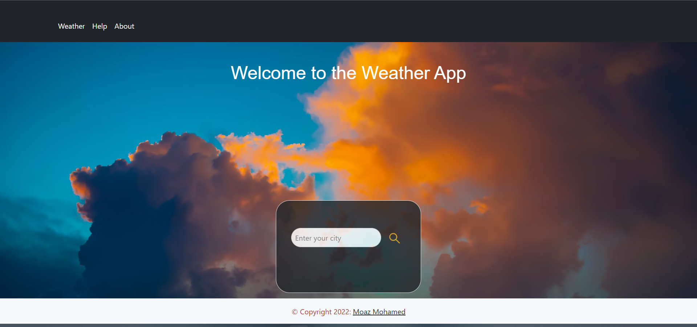
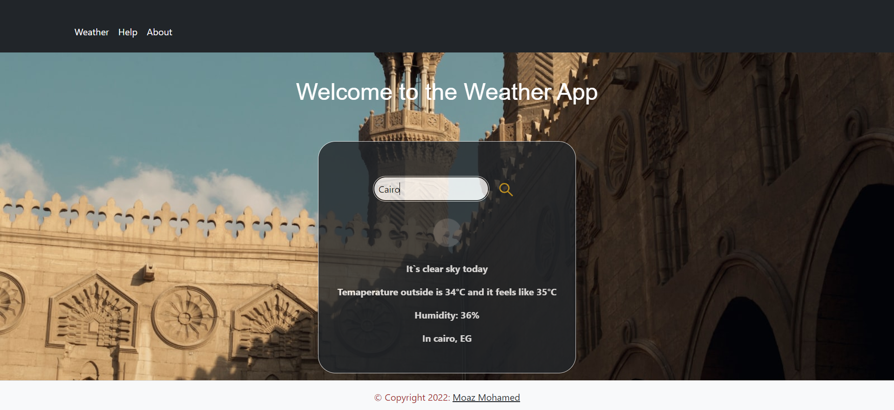

# weather-app

Weather app built with `Node.js`, `Express` framework and the `ejs` templating engine. Deployed using `AWS Elastic Beanstalk`

[Live Demo](http://Weatherapp-env.eba-i2vmznzv.eu-central-1.elasticbeanstalk.com)




* Enter your city to get current weather information



<br>

## Installation

Install project dependencies via npm package manager

```JavaScript
npm install
```

## Usage

* To run the website locally, in the app directory type in the terminal

```bash
$ npm start
```

OR

```bash
$ nodemon src/app.js
```

* Then, in your browser naviage to
  
```text
http://localhost:3000
```